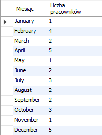

# Bazy danych, informatyka, studia stacjonarne 2024/2025

## Zadania powtórzeniowe, część 2

### 1. Funkcje, agregacja i grupowanie.

**Zadanie 1**
  
Wyświetl imię i nazwisko każdego pracownika i jego rok urodzenia.

**Zadanie 2**

Wyświetl imię i nazwisko pracowników oraz ich wiek w latach (bez uwzględniania miesiąca i dnia urodzenia).

**Zadanie 3**

Wyświetl nazwę działu i liczbę pracowników przypisanych do każdego z nich.

**Zadanie 4**

Wyświetl nazwę kategorii oraz liczbę produktów w każdej z nich.

**Zadanie 5**

Wyświetl nazwę kategorii i w kolejnej kolumnie listę wszystkich produktów należącej do każdej z nich.

**Zadanie 6**

Wyświetl średnie zarobki pracowników z zaokrągleniem do 2 miejsc po przecinku (funkcja round).

**Zadanie 7**

Wyświetl średnie zarobki pracowników, którzy pracują co najmniej od 5 lat.

**Zadanie 8**

Wyświetl 10 najczęściej sprzedawanych produktów *.

\* zapisz 2 rozwiązania:
1. Produkty najczęściej pojawiające się w zamówieniach zrealizowanych.
2. Najwięsza sumaryczna ilość danego prosuktu ze wszystkich zrealizowanych zamówień.

**Zadanie 9**

Wyświetl numer zamówienia, jego wartość (suma wartości wszystkich jego pozycji) zarejestrowanych w pierwszym kwartale 2017 roku.

**Zadanie 10**

Wyświetl imie, nazwisko i sumę wartości zamówień, które dany pracownik dodał. Posortuj malejąco po sumie.

**Zadanie 11**

Wyświetl nazwę działu i minimalną, maksymalną i średnią wartość pensji w każdym dziale.

**Zadanie 12**

Wyświetl pełną nazwę klienta, wartość zamówienia dla 10 najwyższych wartości zamówienia.

**Zadanie 13**

Wyświetl wartość przychodu dla każdego roku. Dane posortuj malejąco według sumy wartości zamówień.

**Zadanie 14**

Wyświetl sumę wartości wszystkich anulowanych zamówień.

**Zadanie 15**

Wyświetl liczbę zamówień i sumę zamówień dla każdego miasta z podstawowego adresu klientów.

**Zadanie 16**

Wyświetl dotychczasowy dochód firmy biorąc pod uwagę tylko zamówienia zrealizowane.

**Zadanie 17**

Policz i wyświetl dochód (przychód z zamówień - cena zakupu towaru) w każdym roku działalności firmy.

**Zadanie 18**

Wyświetl wartość aktualnego stanu magazynowego z podziałem na kategorię produktów.

**Zadanie 19**

Przygotuj zapytanie, które wyświetli dane w poniższej postaci (policz ilu pracowników urodziło się w danym miesiącu - uwaga na porządek sortowania).

**Zadanie 20** *

Wyświetl imię i nazwisko pracownika i koszt jaki poniósł pracodawca od momentu jego zatrudnienia.

* Nie aż tak trudne jak poszukać odpowiedniej funkcji operującej na datach.

